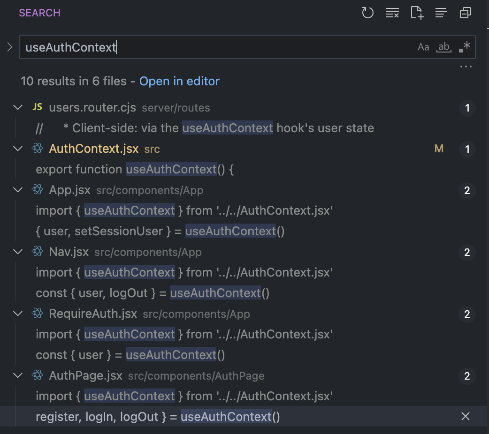

# React Full-Stack w/ Less Abstraction

This is an exploration of building a React/Express app using newer tools/libraries/APIs. Eventually it'll be a multi-user blog with posts, comments, and likes. Maybe there will be some flexbox, because flexbox is all I really know. 🙂

Things that are different from the post-Hooks Prime stack:
* `vite` instead of `CRA`.
* `react-router` v6 instead of v5.
* `express-session` instead of `passport`.
* `Context` instead of `Redux/Redux-Saga`.

## Usage

1. Create a `colors` database.
2. Run the queries from `/db/schema.sql`.
3. Run the queries from `/db/seed.sql`.
4. `npm install`.
5. `npm run server`.
6. `npm run client`.
7. Enjoy using this very advanced application.

## Notes:

My ongoing/condensed notes on how this approach differs from our current stack/curriculum.

#### Vite is gravy.

* The end. It's just awesome. ⚡️
* Weird thing though, any files that aren't using ESM import/export syntax need to use the `.cjs` file extension. (I really dig the explictness of that.)

#### React-router v6 is slightly different and exposes really cool new opt-in features:

* `<NavLink>` is cool.
  * It has extra special powers if following a certain data querying paradigm:
    * https://reactrouter.com/en/main/components/nav-link
  * Otherwise, the difference between Link and NavLink is that NavLink, by default, has an 'active' CSS class applied to it when a user is "at" that route.
* There's a cool new paradigm that uses an `<Outlet/>` wrapper component. It sounds like this is how *Remix* works, and v6 slurped up a good idea that provides a good dev experience.
  * Docs for the `<Outlet />` component:
    * https://reactrouter.com/en/main/components/outlet
  * Check out line 38 here. Everything inside the `'<Layout />` component is nested in both:
    * The React Router path.
    * The React component tree.
    * Kinda neat, but a different approach for sure.
* I haven't gotten all the way through this, but it's worth reading for some context on what React Router is exploring:
  * https://remix.run/blog/remixing-react-router

#### Server-side, auth is much less abstract w/o passport.

* I chose to use cookies/sessions rather than JWT.
  * `express-session` is a very straightforward and less abstract replacement for `passport`.
  * The top answer to this question is why I went with cookies/sessions:
    * https://stackoverflow.com/questions/69002252/jwt-token-based-authentication-vs-session-cookies-best-usage
* I'd be very excited to teach about what happens inside `sessionMiddleware.cjs`, especially getting students to understand the importance of  the `sameSite: true, httpOnly: true` cookie options. (This feels just as important as teaching about password hashing.)
* I used `bcrypt` for the two util functions in `password.cjs`. Are we still thinking we want to switch to `argon2`?

#### Client-side auth is less abstract using Context instead of Redux/Redux-Saga.

Notes on Redux/Redux-Saga vs Context:
* There is still a Provider component.
    * For each context you choose to create, you also create a custom wrapper component to act as the context's Provider.
* Instead of reducers and Saga functions housed in the Redux store, we use React state and JS functions that the context Provider exposes.
* Instead of useSelector to read global Redux state and useDispatch to yell at global Saga functions, any of the context Provider's children can access context state and functions via a useBlahContext hook.

When to use Context?
* Context should **not** be thought of as pure replacement of Redux:
  * If used to hold ALL of an application's global state, it'd causes lots of unnecessary/performance-decreasing re-renders.
    * I am not sure why, but multiple resources indicated this.
 * The **use case for Context** is if you need to have a globally available
   piece of state that doesn't change often. Stuff like themes, locales,
   and user status.
  * It is a great solution for this small handful of use cases.

Overview of how Context works in this app:
* Check out how the `useAuthContext` hook gets used in the four files `import` it:
    * 
* Check out the `AuthContext.jsx` file. I left verbose comments that explain how it works, and especially how it high-level compares/contrasts to a Redux/Redux-Sagas implementation. This all feels very teachable to me. And valuable to teach. 🙂

#### How is Building a Complex CRUD App w/o Redux/Redux-Saga?

* Forthcoming! 🔥

## TO-DOs:

* Refactor `users.router.cjs` to use `async/await`. It'll be so much more readable.
* Break `AuthPage.jsx` into separate `RegisterForm`/`LoginForm` components.